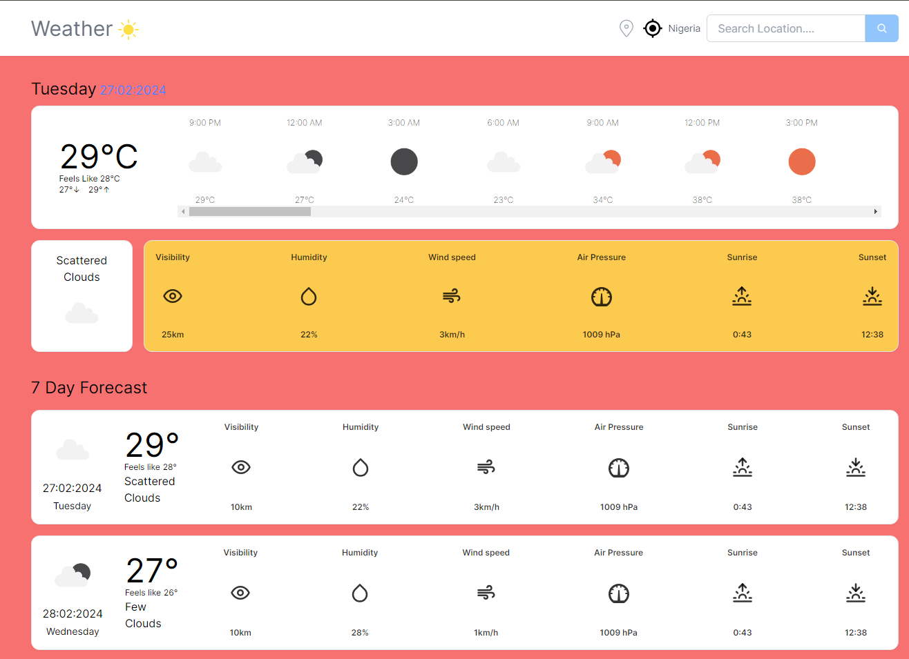

## Overview


Hello everyone.
Here is my simple weather app. It is powered by Next.js 14, TypeScript,Tailwind CSS. I aimed to gain expereince using these tehcnologies by building a simple app that will seek to deliver a great weather experience.✨ 


## Features
<li>
    <ul>Hello
</li>

## Getting Started

First, run the development server:

```bash
npm run dev
# or
yarn dev
# or
pnpm dev
# or
bun dev
```

Open [http://localhost:3000](http://localhost:3000) with your browser to see the result.

You can start editing the page by modifying `app/page.tsx`. The page auto-updates as you edit the file.

